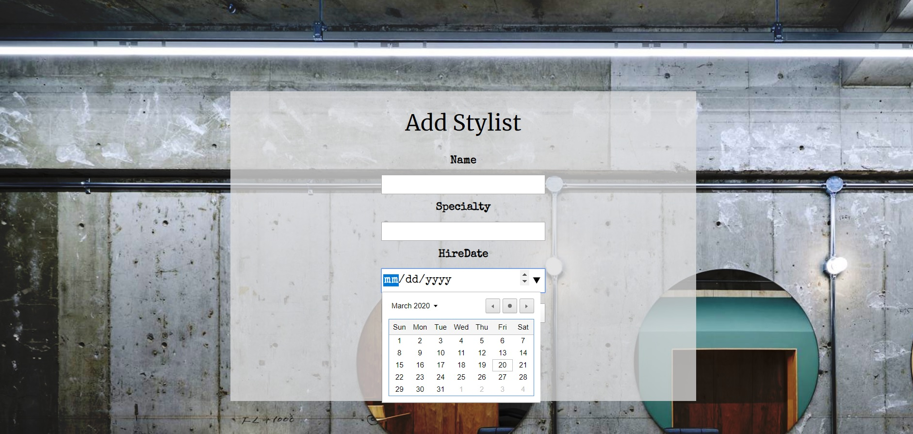
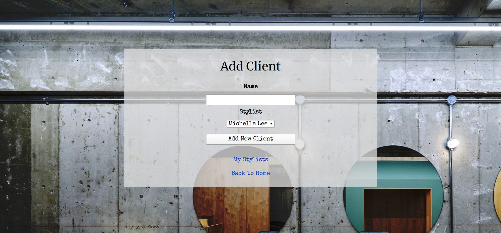

# [Eau Claire's Hair Salon](https://github.com/ayohana/HairSalon.git/)

#### C# Basic Database Web Application Exercise for [Epicodus](https://www.epicodus.com/), 03.20.2020

#### By [**Adela Darmansyah**](https://ayohana.github.io/portfolio/)

## Description

**This web application is for Eau Claire's Salon owner.** This application will help Eau Claire manage her employees (stylists) and their clients. Claire will be able to add a list of all her stylists. For each stylist, Claire will also be able to add a list of clients who see that stylist. Each stylist has a specific specialty, so each client can only see a single stylist.

## Screenshots

#### Application Homepage:

#### Adding a Stylist:

#### Adding a Client for a Stylist:

#### List of all Stylists:

#### Details of a Stylist:

## User Stories

* As the salon owner, I need to be able to see a list of all stylists.
* As the salon owner, I need to be able to select a stylist, see their details, and see a list of all clients that belong to that stylist.
* As the salon owner, I need to add new stylists to our system when they are hired.
* As the salon owner, I need to be able to add new clients to a specific stylist. I should not be able to add a client if no stylists have been added.
* As the developer, I need to assign unique IDs of stylist to each client so that I can set up a one-to-many relationship between stylists and clients.

## Setup/Installation Requirements

* Download [.NET Core](https://www.learnhowtoprogram.com/c-and-net/getting-started-with-c/installing-c-and-net) (Mac/Windows OS) - _FREE!_
* Download [MySQL](https://www.learnhowtoprogram.com/c-and-net/getting-started-with-c/installing-and-configuring-mysql) (Mac/Windows OS) - _FREE!_
* Clone this [repository](https://github.com/ayohana/HairSalon.git/)
  * Open the `Command Line Interface`.
  * Enter `$ cd Desktop` to navigate into your Desktop (or anywhere you'd like to save this repo into).
  * Enter `$ git clone https://github.com/ayohana/HairSalon.git/`.
* Create your database.
  * Open the `Command Line Interface` (CLI).
  * Enter `mysql -uroot -p` and the CLI will prompt for your MySQL password.
  * Enter `CREATE DATABASE database_name;`
  * Enter `USE database_name;` to connect to your database.
  * Enter `CREATE TABLE stylists (StylistID serial PRIMARY KEY, Name VARCHAR (255), Specialty VARCHAR (255), HireDate DATETIME);` to create your table of stylists.
  * Enter `CREATE TABLE clients (ClientID serial PRIMARY KEY, Name VARCHAR(255), StylistID INT);` to create your table of clients.
* Run the application.
  * Navigate into the `HairSalon` directory `$ cd Desktop/HairSalon/HairSalon.Solution/HairSalon`
    * Enter the command `dotnet restore` to gather tools and dependencies for the application.
    * Enter `dotnet run` to run the application.

## Known Bugs

No known bugs at this time.

## Support and contact details

Feel free to provide feedback via email: adela.yohana@gmail.com.

## Technologies Used

* C#
* MVC Pattern
* [MySQL](https://dev.mysql.com/downloads/file/?id=484919) (Windows OS)
* [.NET Core](https://dotnet.microsoft.com/download/dotnet-core/) (Windows OS)
* [Entity Framework Core](https://github.com/PomeloFoundation/Pomelo.EntityFrameworkCore.MySql)

### License

This C# console application is licensed under the MIT license.

Copyright (c) 2020 **Adela Darmansyah**
